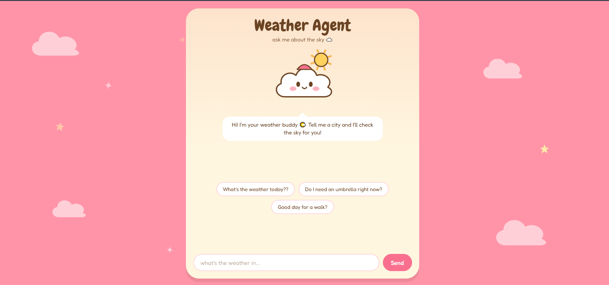

# Weather Agent

An LLM-powered weather agent built with LangChain and LangGraph, with a FastAPI backend and a cute React chat interface. The agent can use a weather API as a tool, maintain short-term conversation memory, and answer follow-up questions based on previous context. A cartoon cloud mascot reacts to the weather the agent looks up.

 

## Features

- LLM-powered agent using Groq
- Tool calling for retrieving current weather
- OpenWeatherMap API integration
- Short-term conversation memory using LangGraph (separate for every visitor)
- Context-aware follow-up questions
- Weather-based recommendations and discussion
- FastAPI backend with a `/chat` endpoint
- React web interface with markdown-rendered replies
- Mascot that changes with the weather (clear, clouds, rain, snow, storm)

## How It Works

The React frontend sends each message to the FastAPI backend. The backend passes it to the agent, which uses an LLM to understand the request and decide when it needs to call the weather tool.

```text
                    User
                      |
                      v
               React Frontend
                      |
                POST /chat
                      |
                      v
               FastAPI Backend
                      |
                      v
                LangChain Agent
                      |
                      v
                     LLM
                      |
             Does it need weather?
                /           \
              Yes            No
               |              |
               v              v
        get_weather()      LLM response
               |
               v
       OpenWeatherMap API
               |
               v
          Weather data
               |
               v
              LLM
               |
               v
         Final response
               |
               v
    { reply, weather } back to the frontend
```

Conversation state is stored using LangGraph's `InMemorySaver`, allowing the agent to remember previous messages during the current session.

## Tech Stack

**Backend**

- Python
- FastAPI
- Uvicorn
- LangChain
- LangGraph
- Groq
- OpenWeatherMap API
- OpenAI GPT-OSS 120B
- python-dotenv

**Frontend**

- React
- Vite
- react-markdown

## Project Structure

```text
weather-agent/
│
├── agent.py
├── main.py
├── requirements.txt
├── .gitignore
├── LICENSE
├── README.md
│
└── weather-agent-frontend/
    ├── index.html
    ├── package.json
    ├── vite.config.js
    └── src/
        ├── main.jsx
        ├── App.jsx
        ├── App.css
        ├── api.js
        ├── hooks/
        │   └── useChat.js
        └── components/
            ├── Background.jsx
            ├── ChatInput.jsx
            ├── Markdown.jsx
            ├── Mascot.jsx
            ├── MessageList.jsx
            ├── Suggestions.jsx
            └── WeatherEffect.jsx
```

- `agent.py` defines the agent, the weather tool and the memory.
- `main.py` is the FastAPI app that exposes the agent.

`.env` is not included in the repository because it contains API keys.

## Setup

### 1. Clone the repository

```bash
git clone https://github.com/h-arshadd/weather-agent.git
cd weather-agent
```

### 2. Create a virtual environment

Windows:

```powershell
python -m venv venv
```

Activate it:

```powershell
.\venv\Scripts\Activate.ps1
```

### 3. Install backend dependencies

```powershell
pip install -r requirements.txt
```

### 4. Add environment variables

Create a `.env` file in the project root:

```env
GROQ_API_KEY=your_groq_api_key
OPENWEATHERMAP_API_KEY=your_openweathermap_api_key
```

You need API keys from:

- Groq
- OpenWeatherMap

### 5. Run the backend

```powershell
uvicorn main:app --reload
```

The API runs at `http://localhost:8000`, and the interactive docs are at `http://localhost:8000/docs`.

### 6. Run the frontend

You need Node.js 18 or newer. In a second terminal:

```powershell
cd weather-agent-frontend
npm install
npm run dev
```

Open `http://localhost:5173`.

## Configuration

Both of these are only needed when you deploy.

| Variable | Where | Purpose |
|----------|-------|---------|
| `VITE_API_URL` | Frontend (`.env.production` or host settings) | Backend URL, e.g. `https://your-backend.com/chat`. Defaults to `http://localhost:8000/chat`. Set it before `npm run build`. |
| `ALLOWED_ORIGINS` | Backend | Comma-separated list of frontend URLs allowed by CORS. Defaults to `http://localhost:5173`. |

## API

### `POST /chat`

Request:

```json
{
  "message": "What's the weather in London?",
  "session_id": "6f1c0c8e-3b1a-4c1e-9b0e-2f4d5a7c9d10"
}
```

Response:

```json
{
  "reply": "It's drizzling in London right now...",
  "weather": "rain"
}
```

`weather` is one of `clear`, `clouds`, `rain`, `snow` or `storm`. It is `null` when the agent did not look up the weather for that message, and the mascot keeps its last look.

The backend reads the condition from the weather tool's output:

| OpenWeatherMap status | `weather` |
|-----------------------|-----------|
| Clear | `clear` |
| Clouds, mist, fog, haze | `clouds` |
| Rain, drizzle | `rain` |
| Snow, sleet | `snow` |
| Thunderstorm | `storm` |

## Example

```text
You: hi. tell me about weather in [location]

Agent: The current weather in [location] is ...

You: is this good weather to go for a walk?

Agent: If you enjoy cooler weather, this looks like a good time
for a walk ...

You: what city did i ask you about?

Agent: You asked about [location].
```

The agent can use information from earlier messages because short-term conversation memory is enabled.

## Agent and Tool Calling

The weather functionality is exposed to the LLM as a tool:

```python
@tool
def get_weather(location: str) -> str:
    """Get current weather information for a location."""
    return weather_wrapper.run(location)
```

The LLM decides when this tool is necessary.

For example, a request that does not require current weather can be answered directly:

```text
User: What is a good time to go for a walk?

LLM → Responds directly
```

A request for current weather requires the tool:

```text
User: What's the weather in [location]?

LLM → Calls get_weather("[location]")
    → OpenWeatherMap
    → Receives weather data
    → Generates response
```

## Short-Term Memory

The agent uses LangGraph's `InMemorySaver` as a checkpointer.

The frontend generates a `session_id` every time the page loads and sends it with each message. The backend uses it as the `thread_id`, so every visitor gets their own conversation:

```python
config = {
    "configurable": {
        "thread_id": request.session_id
    }
}
```

As long as the backend is running and the page is not refreshed, the agent can access previous messages in that conversation.

This memory is stored in RAM, so it is **not persistent**. Restarting the backend or refreshing the page starts a fresh conversation.

## Limitations

- Memory is lost when the backend restarts or the page is refreshed.
- Weather information depends on the OpenWeatherMap API.
- The mascot only changes when the agent looks up the weather.
- No database or persistent memory is implemented.

## License

This project is licensed under the MIT License. See the [LICENSE](LICENSE) file for details.